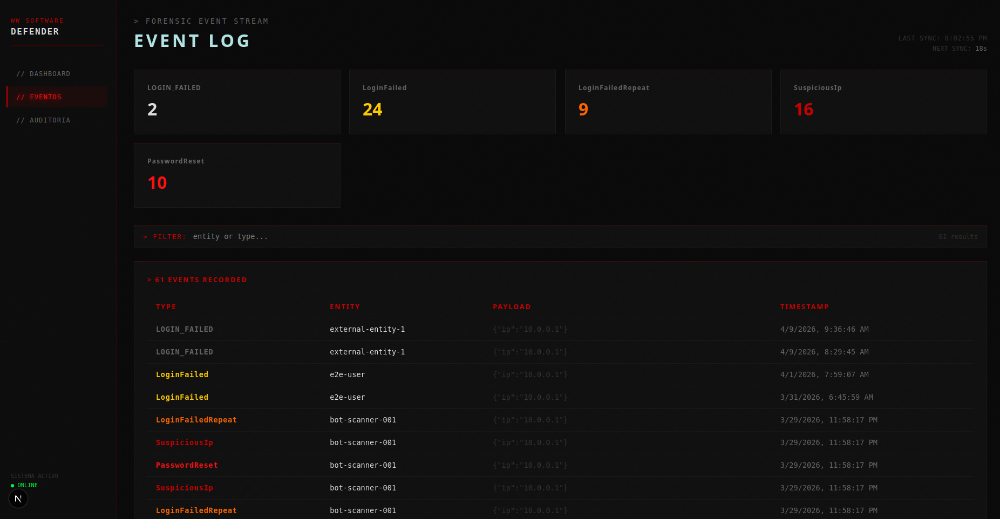
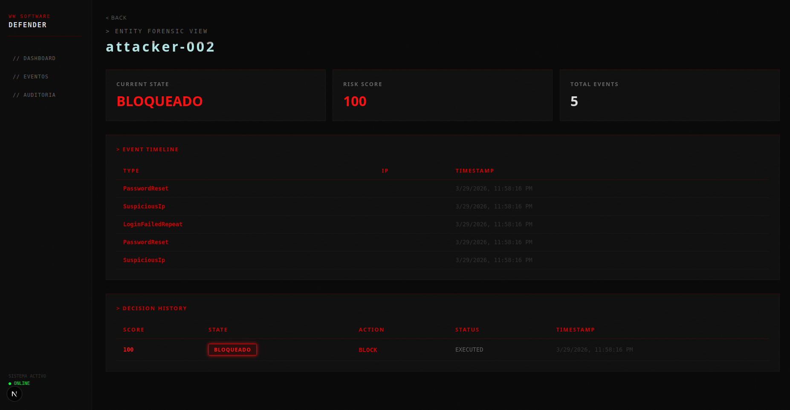

# WW Software Defender
**Intelligent Forensic Monitoring System**

> Real-time security decision engine — detect → evaluate → decide → act → audit.

[](https://ww-software-defender.vercel.app)
[](https://ww-software-defender.vercel.app)
[](https://www.typescriptlang.org)
[](https://nestjs.com)
[](https://nextjs.org)

---

## What is this?

WW Software Defender is a production-grade security decision engine that closes the full loop between threat detection and defensive action — without constant human intervention.

Instead of just logging alerts, the system **automatically decides and acts**:
Event received → Risk calculated → Entity state defined → Decision made → Action executed → Audit recorded
Every decision is fully traceable, auditable, and explainable.

---

## Live Demo

**Production:** https://ww-software-defender.vercel.app

---

## Screenshots

### Dashboard

*Real-time KPIs, risk timeline, and audit logs*

### Event Stream

*Live event stream with filtering and auto-refresh*

### Audit Trail

*Full forensic trail — every decision traced and explained*

### Entity Drill-Down

*Per-entity forensic view — event history, risk evolution, decisions*

---

## Core Features

- **Full decision engine** — Event → Risk → State → Decision → Action → Audit
- **Automatic Risk Score** (0–100) with configurable behavioral rules
- **Automatic entity states** — `NORMAL` | `SUSPICIOUS` | `ALERT` | `CRITICAL` | `BLOCKED`
- **Automatic defensive decisions** — `ALLOW` | `THROTTLE` | `CHALLENGE` | `BLOCK`
- **Dual authentication** — JWT + API Keys for external system integration
- **Webhooks with retry** — real-time notifications on critical events
- **Rate limiting** — per entity and per IP via Redis
- **Multi-tenancy** — schema-based isolation per client
- **Full audit trail** — complete forensic traceability of all decisions
- **Real-time dashboard** — KPIs, charts, risk timeline, live audit logs
- **Entity drill-down** — full forensic view per monitored entity

---

## Tech Stack

| Layer | Technology |
|-------|------------|
| Monorepo | Turborepo + npm workspaces |
| Backend | NestJS + TypeORM + PostgreSQL |
| Cache / Rate Limiting | Redis + @keyv/redis |
| Auth | JWT + Passport + API Keys |
| Frontend | Next.js + Framer Motion |
| Production Infrastructure | Render + Supabase + Upstash + Vercel |
| Staging Infrastructure | Render + Supabase + Upstash |
| CI/CD | GitHub Actions — CI + Deploy Staging + Deploy Production |
| Quality | ESLint + Husky + Commitlint |
| Tests | 31 unit tests + 12 E2E tests |

---

## Architecture
Event received via API
↓
Risk Engine — calculates behavioral score (0–100)
↓
State Engine — maps score to entity state
↓
Decision Engine — determines defensive action
↓
Action Engine — executes and notifies via webhook
↓
Audit Engine — records full forensic trail

**Multi-tenancy:** schema-based PostgreSQL isolation per client — each tenant has a fully isolated data environment.

**Deploy pipeline:**
feature/ → develop → staging (CI + auto deploy) → main (CI + manual approval + deploy)

---

## API Overview

The system exposes a REST API for external integration:

```bash
# Authenticate
POST /api/auth/token

# Send a security event
POST /api/events

# Query risk, state, decision
GET /api/risk/:entityId
GET /api/state/:entityId
GET /api/decision/:entityId

# Execute defensive action
POST /api/action/:entityId

# Forensic audit trail
GET /api/audit/:entityId
```

External systems can integrate directly via `x-api-key` header — no JWT required.

---

## Contact

**Kelson Filipe** — Full-Stack Engineer
- GitHub: [@kelsonFilipeDev](https://github.com/kelsonFilipeDev)
- Email: kelsonfilipedev@gmail.com
